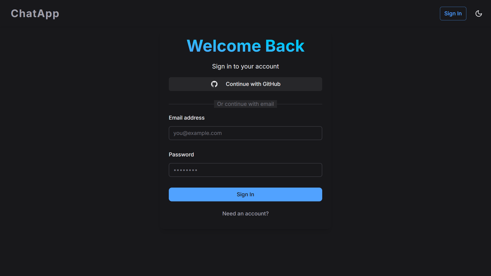

# AI Chat App

Is available right there: [rovert-chat-app](https://rovert-chat-app.pages.dev/)

## Introduction

This will be a simple AI powered chat application with focus on simplicity and privacy. The user will be able to chat with the AI and get responses.



## Features

- Chat with different AI models (with local models support)
- Authentication
- Profiles with avatars
- Light/Dark mode

### Technologies

- [Nuxt.js](https://nuxtjs.org/)
- [Supabase](https://supabase.io/)
- [Tailwind CSS](https://tailwindcss.com/)
- [Cloudflare Pages](https://pages.cloudflare.com/)

## Setup

Make sure to install dependencies:

```bash
# npm
npm install
```

Project uses [Supabase](https://supabase.com) so rename `.env.example` to `.env` and fill in the required values. You can get the values from your Supabase project settings.

```bash
SUPABASE_URL="YOUR_SUPABASE_URL"
SUPABASE_KEY="YOUR_SUPABASE_KEY"
```

## Development Server

Start the development server on `http://localhost:3000`:

```bash
# npm
npm run dev
```

## Production

Build the application for production:

```bash
# npm
npm run build
```

Locally preview production build:

```bash
# npm
npm run preview
```

Deploy to Cloudflare pages if wrangler is installed:

```bash
# npm
npm run deploy
```

Check out the [deployment documentation](https://nuxt.com/docs/getting-started/deployment) for more information.
